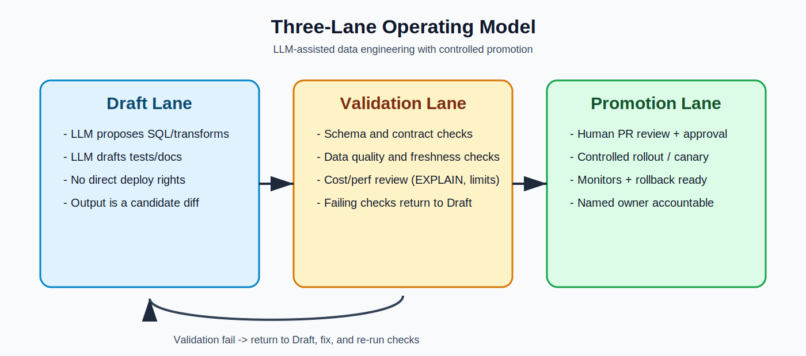

# LLMs for Data Engineers

LLMs are a force multiplier for data engineering, not a substitute for data engineering discipline. They are great at speeding up SQL and pipeline work, debugging clues, and documentation, but they are not reliable judges of correctness, data quality, cost, or compliance on their own. Treat them like a fast assistant with broad recall and no accountability. **Human ownership of contracts, tests, lineage, and production decisions is non-negotiable.**

Use LLMs where the work is expensive in time but cheap to verify. That means drafting SQL, translating business questions into candidate queries, generating dbt model skeletons and tests, explaining failing jobs, writing runbooks, and surfacing likely root causes from logs. Do not use LLMs as autonomous arbiters of truth. They should not decide production schema changes, retention policies, PII handling, merge behavior, or incident actions without explicit human approval and hard guardrails. **AI can accelerate change; humans own blast radius.**

**Use cases that usually pay off fast: SQL drafting, test generation, documentation, incident triage notes, and migration boilerplate.** Use cases that usually hurt if rushed: autonomous schema evolution, automatic backfills, policy-sensitive data handling, and anything that can create silent correctness regressions at scale. Start with low-blast-radius work, prove value, then expand carefully.

## Three-Lane Operating Model

Use this flow every time: draft candidate changes, validate with deterministic gates, then promote with explicit human approval. If validation fails, route back to draft and iterate.

## Pragmatic Operating Notes
Set clear action boundaries up front. Keep AI work in a draft-to-validation-to-promotion flow, with write actions constrained to PR workflows and production changes gated by explicit human approval. The model can generate candidate SQL, transforms, and tests quickly, but correctness and safety still come from deterministic checks and review discipline.

For SQL and transform work, verify semantics, not syntax. Most failures come from wrong grain, wrong join assumptions, null behavior, timezone drift, and cost blowups that looked reasonable at generation time. Treat every generated query as a draft and validate against known-good data and production constraints before merge.

For pipeline changes, keep rollout behavior conservative. Backfill bounds, retry semantics, lineage impact, and rollback readiness matter more than how quickly the code was generated. Stage changes, watch quality and freshness signals, and keep on-call ownership explicit.

During incidents, use LLMs for hypothesis generation, not adjudication. Pull logs, diffs, and quality signals first, then use the model to propose candidate causes and remediation options. Confirm each hypothesis with deterministic checks before acting.

If you track impact, focus on lead time, defect escape rate, data quality incident frequency, and cost-per-run. Speed gains only matter if correctness and reliability remain stable.

## Bottom line
Use LLMs to move faster on drafting and analysis. Keep correctness, governance, and deploy decisions under explicit human control.

## Addendum: References and Key Points
1. [BigQuery: Write queries with Gemini assistance](https://docs.cloud.google.com/bigquery/docs/write-sql-gemini)  
Key points: Gemini can generate, explain, and autocomplete SQL/Python; outputs can be plausible but incorrect so validation is required; schema metadata like column descriptions improves quality; Google states prompts and responses are not used for model training without express permission.

2. [BigQuery: Data Engineering Agent for pipelines](https://docs.cloud.google.com/bigquery/docs/data-engineering-agent-pipelines)  
Key points: Agent can draft and edit Dataform SQLX pipelines from natural language, supports persistent `GEMINI.md` instructions, and can add assertions; current limitations include pre-GA status and no direct pipeline execution by the agent; users still review and run/schedule pipelines; context can include metadata and sample rows and is documented as not used for training.

3. [Databricks Assistant (AWS docs)](https://docs.databricks.com/aws/en/notebooks/code-assistant)  
Key points: Assistant is context-aware, can generate/fix/explain SQL and Python, and uses Unity Catalog metadata for context; proposed code is accepted/rejected in a diff flow and does not auto-run after acceptance.

4. [Databricks Anomaly Detection](https://docs.databricks.com/aws/en/data-quality-monitoring/anomaly-detection)  
Key points: Monitors schema tables for freshness and completeness using historical patterns, includes alerting/logging and root-cause views, and is currently documented as Beta with explicit limitations.

5. [Snowflake Cortex Analyst](https://docs.snowflake.com/en/user-guide/snowflake-cortex/cortex-analyst)  
Key points: Reliable NL-to-SQL depends on semantic models (semantic views/YAML), not raw schema guessing; docs call out multi-turn limitations and rising cost with longer history; model and feature access can be controlled with account settings and RBAC.

6. [Microsoft Fabric Data Factory Copilot](https://learn.microsoft.com/en-us/fabric/data-factory/copilot-fabric-data-factory-get-started)  
Key points: Copilot can generate pipelines, transformation expressions, summaries, and troubleshooting guidance; Microsoft explicitly warns that AI surprises/mistakes are possible; availability and regional/compliance settings are tenant/capacity dependent.

7. [AWS Glue Data Quality](https://docs.aws.amazon.com/glue/latest/dg/glue-data-quality.html)  
Key points: Rule-based data quality evaluation with quality scores, catalog/ETL integration, APIs, and defined service limits; supports ongoing governance workflows rather than one-off checks.

8. [dbt Copilot GA announcement](https://www.getdbt.com/blog/dbt-copilot-is-ga)  
Key points: dbt positions Copilot as context-aware AI over metadata and lineage inside dbt workflows, with emphasis on documentation/tests/semantic artifacts and enterprise controls such as BYOK and Azure OpenAI integration.
